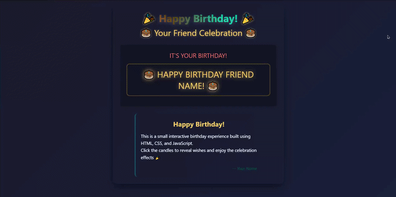

# Interactive Birthday Celebration Website

## Preview

## Features

* Interactive birthday cake with clickable candles
* Animated confetti and balloons
* Dynamic wish cards
* Responsive mobile-friendly design
* Custom CSS animations
* Personalized celebration messages

## Technologies

* HTML5
* CSS3
* Vanilla JavaScript

## Purpose

This project demonstrates front-end development concepts including DOM manipulation, event handling, CSS animations, responsive layouts, and interactive user experiences.
